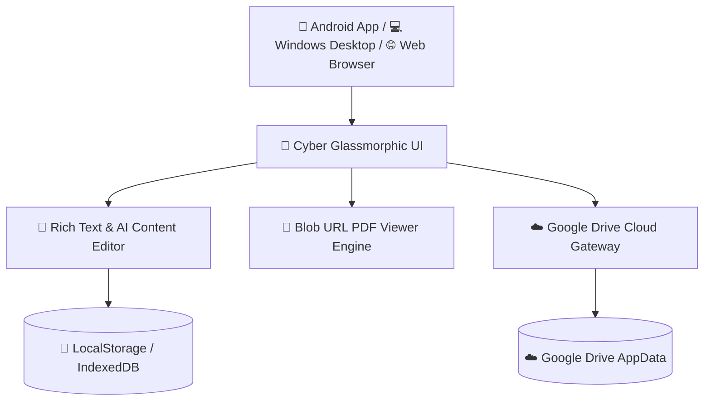

<div align="center">

  <!-- Animated Header Banner -->
  <a href="https://github.com/dilusha034/Notes-Category-Campus-Pro">
    
  </a>

  <p align="center">
    <b>A Next-Generation Cyber Glassmorphic Academic Management Suite & PDF Reader for University & College Students 🚀</b>
  </p>

  <!-- Badges -->
  <p align="center">
    <a href="https://github.com/dilusha034/Notes-Category-Campus-Pro/raw/main/Notes-Category-Campus-Pro.apk">
      
    </a>
    <a href="https://dilusha034.github.io/Notes-Category-Campus-Pro/">
      
    </a>
    <a href="https://github.com/dilusha034/Notes-Category-Campus-Pro">
      
    </a>
    <a href="https://github.com/dilusha034/Notes-Category-Campus-Pro/blob/main/LICENSE">
      
    </a>
  </p>

</div>

---

## ⚡ Direct Downloads & Quick Access

| Platform | Download Link | Description |
| :--- | :--- | :--- |
| **📱 Android App (.apk)** | [**📥 Download v5.6 APK**](https://github.com/dilusha034/Notes-Category-Campus-Pro/raw/main/Notes-Category-Campus-Pro.apk) | Direct APK for Android Phones & Tablets |
| **🌐 Web Application** | [**🚀 Launch Web App**](https://dilusha034.github.io/Notes-Category-Campus-Pro/) | Works in any modern Web Browser instantly |
| **💻 Windows App (.exe)** | [**📥 Download Setup (.exe)**](https://github.com/dilusha034/Notes-Category-Campus-Pro/raw/main/dist/Notes%20Category%20Campus%20Pro%20Setup%203.2.0.exe) | Desktop Software for Windows 10/11 PCs |

---

## 🌟 Mind-Blowing Features & Capabilities

### 🎓 1. 4-Level Academic Structure
Seamlessly structure your degree or diploma across:
$$\text{Faculty} \longrightarrow \text{Academic Year} \longrightarrow \text{Semester} \longrightarrow \text{Subject} \longrightarrow \text{Notes \& Modules}$$

### 📝 2. In-Place Fullscreen Rich Text & AI Note Editor
* **In-Place Editing:** Edit your notes inside the Fullscreen Reader without navigating away or losing context.
* **AI Paste Cleaner:** Copy text directly from ChatGPT, Gemini, or Claude — formatting, code blocks, headers, and colors automatically clean up.
* **Rich Text Toolbar:** Custom highlighter colors, font scaling, headings, lists, eraser, and color pickers.

### 📎 3. PDF & Photo Attachment Manager (with 1-Click Delete & Word Cursor)
* **Inline Attachments:** Attach local PDF documents and Images directly inside any note paragraph.
* **1-Click Deletion:** Every attachment badge features a sleek red `✕` delete button to instantly remove mistakenly added files.
* **Atomic Object Behavior (`contenteditable="false"`):** Attachments act like MS Word / Google Docs inline objects. You can seamlessly type past any attached PDF or photo without your cursor getting trapped inside!

### 📌 4. PDF Reader & Blob URL Auto-Bookmark Jumping
* **Blob Engine PDF Viewer:** Converts Base64 data into Blob URLs to ensure PDF rendering works smoothly across Android WebViews and Desktop Browsers.
* **Persistent Page Auto-Bookmark:** Set a bookmark (e.g. Page 2, Page 15). Next time you click the PDF attachment tag, it **instantly jumps to that exact page**!
* **✏️ Live Title Renaming:** Rename any attached PDF or Photo on the fly directly from the viewer drawer header.

### 📅 5. Dynamic Academic Timetable & Exam Tracker
* Manage weekly lecture schedules with Google Calendar style time pickers.
* Integrated exam countdown timer to track mid-semester and final exams.

### ☁️ 6. Google Drive Cloud Sync Gateway
* Connect your Google Account for cross-device synchronization between Android Phone and Desktop PC.
* Zero storage impact: Stores app state securely in Google Drive AppData folder without consuming your personal Drive quota.

---

## 🛠️ Technical Stack & Architecture



* **Frontend Engine:** HTML5, Modern Vanilla CSS (Glassmorphic Design Tokens), JavaScript ES6+
* **PDF Rendering:** Blob Stream Engine + Native PDF Embed Architecture
* **Mobile Bridge:** Capacitor Android 5.0+ / Java 21 JDK
* **Desktop Wrapper:** Electron / Node.js

---

## 📦 How to Build & Run Locally

### Prerequisites
* Node.js (v18+)
* Java JDK 21 (for Android APK builds)

### 1. Run Web Version Locally
```bash
# Simply open index.html in any browser or run a local server
npx serve .
```

### 2. Build Android APK
```bash
# Sync Capacitor web assets
npx cap copy android

# Build debug APK using Gradle
cd android
.\gradlew assembleDebug
```

---

## 📜 License
Distributed under the **MIT License**. See `LICENSE` for more information.

<div align="center">
  <b>Crafted with ❤️ for Campus & University Students Worldwide</b>
</div>
